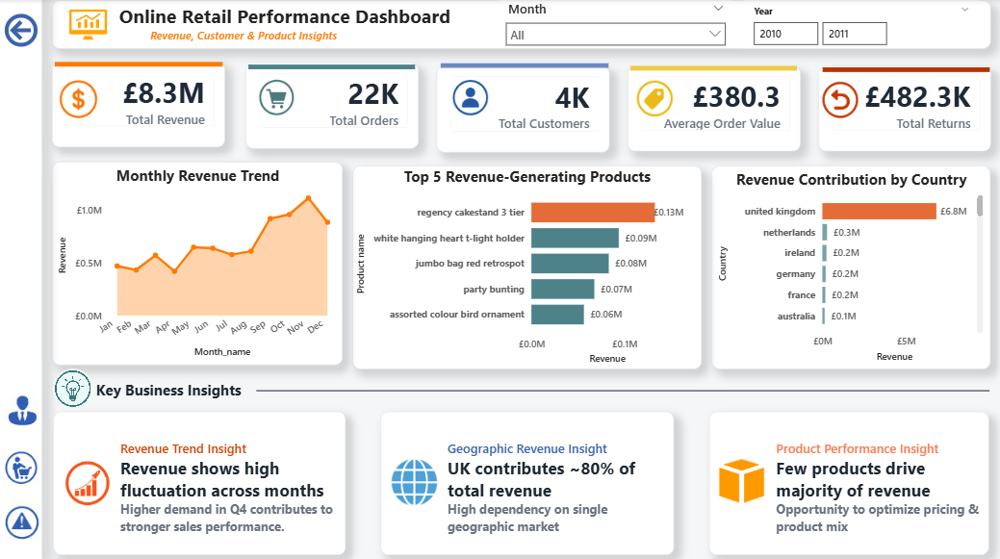
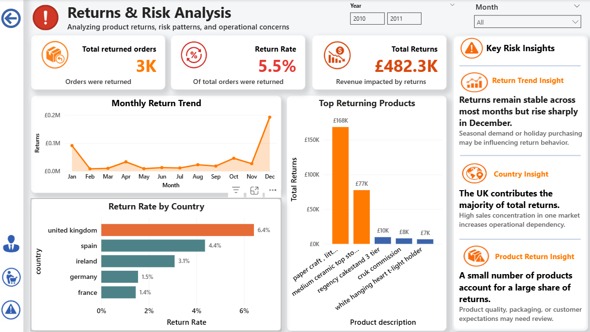

# Online Retail Sales Analysis Dashboard

## Project Overview

This project analyzes online retail sales data using SQL and Power BI to uncover insights related to revenue trends, customer behavior, product performance, and return risks.

The dashboard was designed to support business decision-making through KPI tracking, interactive visualizations, and business insights.

## Tools & Technologies

- SQL
- Power BI
- DAX
- Power Query
- Data Modeling

## Dashboard Pages

### 1. Executive Overview
- Revenue trends
- KPI analysis
- Country contribution
- Business performance overview

### 2. Customer & Product Analysis
- Customer segmentation
- Product performance
- Revenue vs quantity analysis
- Repeat customer insights

### 3. Returns & Risk Analysis
- Return trends
- Product return analysis
- Geographic return analysis
- Revenue impact of returns

## Key Insights

- The UK contributes the majority of total revenue.
- Revenue growth strengthens during the final quarter of the year.
- Repeat customers contribute significantly to recurring sales.
- Returns increase sharply during year-end periods.

# Online Retail Sales Analysis

## Executive Dashboard Overview

## Customer and Product Analysis

## Risk and Returns Analysis

